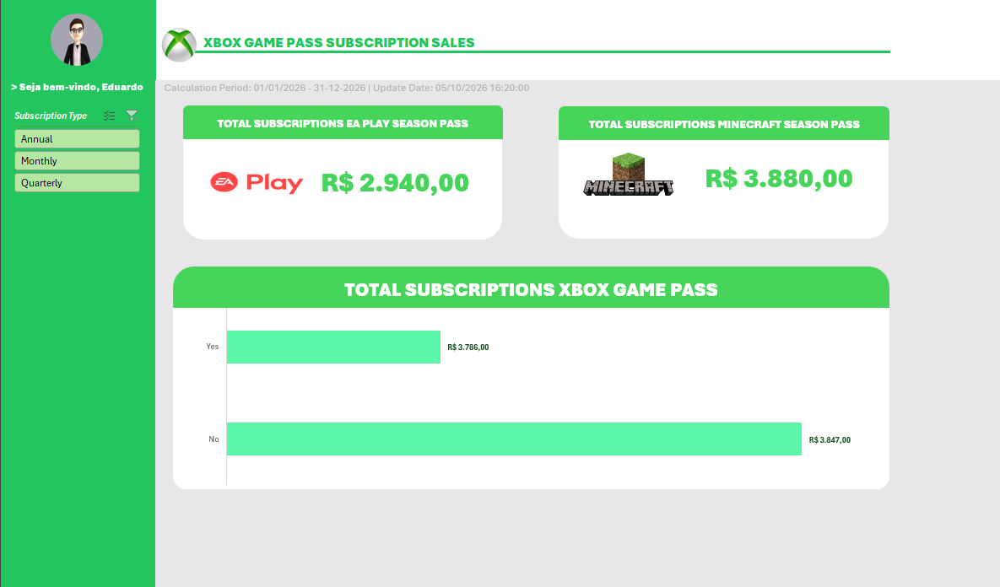

# 🎮 Dashboard de Vendas Xbox

## 📌 Sobre o Projeto

Este projeto consiste na criação de um Dashboard de Vendas utilizando o Microsoft Excel, com o objetivo de transformar dados brutos em informações visuais claras e úteis.

---

## 📊 Preview do Dashboard

Abaixo está uma prévia do resultado final desenvolvido:

---

## 🎯 Objetivo

O objetivo do projeto é organizar e visualizar dados de vendas de forma clara, permitindo uma análise mais eficiente das informações e facilitando a identificação de resultados e tendências.

---

## 🗂️ Arquivos do Projeto

- 📊 **[Dashboard_Xbox.xlsx](Dashboard_Xbox.xlsx)** — dashboard finalizado.
- 📑 **[Base.xlsx](Base.xlsx)** — base de dados utilizada no projeto.
- 🖼️ **Dashboard_Xbox_finalizado.png** — imagem de demonstração do dashboard.

---

## 🛠️ Tecnologias Utilizadas

- Microsoft Excel
- Tabelas
- Fórmulas
- Gráficos
- Indicadores
- Dashboard
- Análise e visualização de dados

---

## 📚 Aprendizados

Durante o desenvolvimento do projeto, foram aplicados conhecimentos relacionados à organização, análise e visualização de dados utilizando o Microsoft Excel.

O projeto possibilitou praticar a transformação de dados brutos em informações visuais, utilizando indicadores e gráficos para facilitar a interpretação dos resultados.

---

## 👨‍💻 Autor

**Eduardo Silva**

Projeto desenvolvido para fins de estudo e demonstração de conhecimentos em Excel, análise de dados e construção de dashboards.
